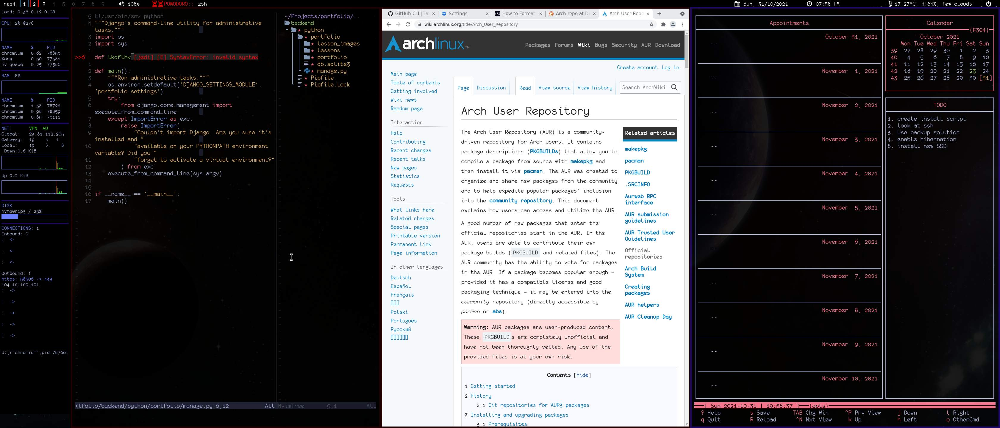

### Start at the following to install Arch.
(Great instructions by LearnLinuxTv)
https://www.youtube.com/watch?v=DPLnBPM4DhI       
then as root....

#### Create your desktop dirs
```shell

mkdir -p "$HOME"/{Downloads,Notes,Media,Scripts,Videos,Music,Builds,Projects,Images/wallpapers}
```

### Install depenendencies
```shell

pacman -Syu
pacman -S --no-confirm \
ufw \ #Firewall
zsh zsh-completions zsh-autosuggestions \ #Shell
man-db mlocate \ #Docs 
xorg-server xorg-xrandr xorg-xsetroot xorg-xdpyinfo xorg-fonts-misc xinit xdotool xmodmap xorg-server-xephyr \ #Xorg and tools
kitty termite \ #Terminals
neovim \ #Editor
bspwm sxhkd qtile i3 rofi picom dunst nitrogen conky polybar \ #Window managers and graphics
alsa-utils alsaplugins pulseaudio pulseaudio-alsa \ #Audio
xclip udiskie usbutils trash-cli maim unzip \ #Desktop tools
fontconfig ttf-monofur ttf-font-awesome ttf-dejavu \ #Fonts
mpv youtube-dl playerctl \ #Audio media
curl wget firefox chromium \ #Internet browsing
photoflare mupdf \ #Image and pdf viewer 
python-pip nodejs npm gpick \ #Programming stuff
virtualbox virtualbox-guest-iso \ #Run vms
calcurse \ #A great calander
```


#### Get Paru for Easy AUR builds
```shell

cd ~/Builds && git clone https://aur.archlinux.org/paru-bin.git 
cd paru-bin && makepkg -cCi 
```

#### Install AUR dependencies
```shell

paru -S polybar nordvpn-bin brave-bin htop-vim-git sc-im-git zsh-fast-syntax-highlighting zsh-vi-mode 
```

#### Setup neovim like an IDE
```shell

curl -fLo ~/.config/nvim/autoload/plug.vim --create-dirs \
	https://raw.githubusercontent.com/junegunn/vim-plug/master/plug.vim
```
and in neovim:
```vimscript

:PlugInstall
:CocInstall coc-json coc-tsserver coc-ccls coc-jedi coc-go coc-css coc-java coc-dictionary

```

*fix for coc-ccls*
```shell

cd ~/.config/coc/extensions/node_modules/coc-ccls && ln -s node_modules/ws/lib lib
```

TODO post installation:

* Set zsh as default shell
```shell

chsh -s $(which zsh)
```
	
* Enable firewall
```shell

	ufw enable   
	systemctl enable --now ufw
```

* Update file db
```shell

updatedb     
``` 
	
* Unmute alsa. Volume control through Pulse.
```shell

amixer sset Master unmute && amixer sset Speaker unmute && amixer sset Headphone unmute
```
	
* Enable nordvpn
```shell

systemctl enable --now nordvpnd
gpasswd -a $USER nordvpn
```
	
* Setup swap only for hibernation purposes; Limit swapiness.
```shell

/bin/sh -c 'echo "vm.swapiness=1" >> /etc/sysctl.d/99-sysctl.conf'
sysctl vm.swappiness=1
```
	
* Change wireless and eth interface names in conky config according to sys hardware.
* Input city id for weather info in qtile config.
* If you have multiple screen resolutions and refresh rates, input the values for res_[\d] and rate_[\d] in .zshrc.
* Add chrome extensions
	"unhook" for youtube.
	"vimium". 

reboot.
